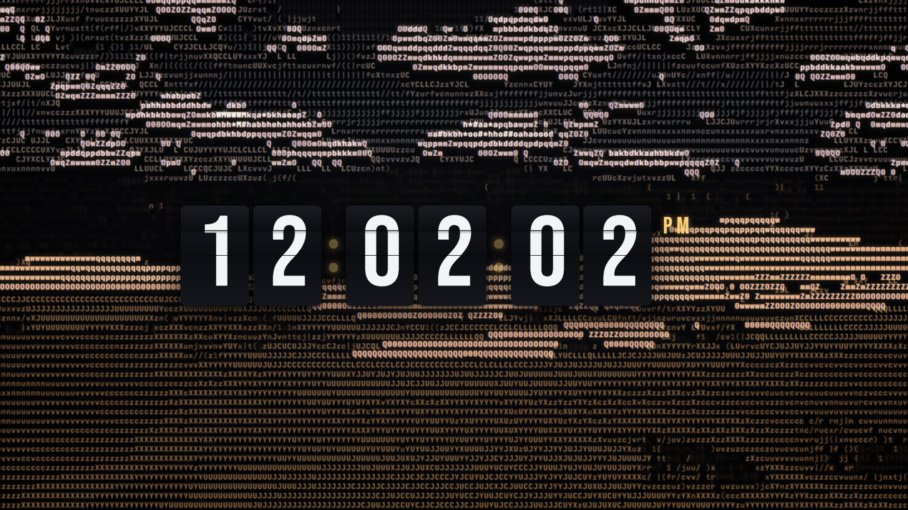

# ascii-clock

A fullscreen ambient display for a second monitor. Pulls landscape photos from Unsplash, renders them as multi-layer ASCII art with a real **AI-estimated depth map** (Depth Anything via transformers.js, in-browser, WebGPU-accelerated), and overlays a large **split-flap digital clock** with parallax, Ken Burns drift, and subtle chroma aberration.

No admin install, no Python — pure Node + browser.



---

## Features

- **ASCII renderer** — viewport-filling character grid sampled from the source photo, tinted by the photo's dominant color.
- **Depth-driven layering** — Depth Anything (small, quantized) splits the scene into background / mid / foreground layers, each with its own blur, opacity, and Z-offset.
- **Combined depth effects** — per-layer parallax (mouse + auto-drift + device tilt) + foreground chroma aberration + slow Ken Burns zoom + crossfade between images.
- **Split-flap clock** — 12-hour HH:MM:SS + AM/PM, Bebas Neue, ~60% of viewport width. Top half flips down then bottom half flips up on every digit change, with only the changed digits animating.
- **Unsplash integration** — random landscape queries with prefetch queue and photographer credit per API guidelines.
- **WebGPU when available**, automatic fallback to WASM. Respects `prefers-reduced-motion`.

---

## Requirements

- Node.js 20+ (tested on 22.x)
- A modern Chromium-based browser (Chrome, Edge, Brave) for WebGPU
- A free Unsplash **Demo** access key — [create an app here](https://unsplash.com/oauth/applications)

---

## Installation

### 1. Clone / open the folder

```powershell
cd "D:\Programming\ASCII art animations"
```

### 2. Install dependencies

```powershell
npm install
```

> **Behind a flaky network?** If `registry.npmjs.org` keeps dropping connections (ECONNRESET), use the mirror once:
>
> ```powershell
> npm install --registry=https://registry.npmmirror.com
> ```
>
> Or set it permanently for your user:
>
> ```powershell
> npm config set registry https://registry.npmmirror.com
> ```

The depth-estimation runtime (`@huggingface/transformers`) is **not** installed via npm — it's loaded from a CDN at runtime to keep the install slim (~17 packages, ~6 s).

### 3. Add your Unsplash key

Copy the example file and paste your access key:

```powershell
Copy-Item .env.example .env.local
notepad .env.local
```

```env
VITE_UNSPLASH_ACCESS_KEY=your_demo_key_here
```

> Without a key, the app still runs — it falls back to a generated gradient background so the clock and effects remain visible.

### 4. Start the dev server

```powershell
npm run dev
```

Open the printed URL (usually <http://localhost:5173/>). Drag the window to your second monitor and press **F** for fullscreen.

### 5. Build (optional, for `vite preview`)

```powershell
npm run build
npm run preview
```

---

## Keyboard shortcuts

| Key       | Action                                         |
| --------- | ---------------------------------------------- |
| `F`       | Toggle fullscreen                              |
| `N`       | Skip to next image (uses prefetched queue)     |
| `H`       | Show / hide the clock                          |
| `D`       | Toggle depth layering & parallax               |
| `Space`   | Pause / resume the auto image cycle            |

The cursor auto-hides after 3 s of inactivity. The hotkey hint fades out after the first 8 s.

---

## Configuration

The most useful knobs live near the top of [src/main.ts](src/main.ts):

| Constant     | Default     | Meaning                                                                                       |
| ------------ | ----------- | --------------------------------------------------------------------------------------------- |
| `CYCLE_MS`   | `120_000`   | Milliseconds between image swaps. 2 min = ~6 API requests/hour (well under the 50/hr demo cap). |
| `ASCII_CELL` | `10`        | Pixel size of each ASCII cell. Smaller = denser art, more GPU.                                |

### Unsplash rate limits

- **Demo tier:** 50 requests / hour per app.
- The app calls `/photos/random?count=5` once per refill, so **one request feeds 5 image cycles**.
- At `CYCLE_MS = 120_000` (2 min), that's roughly 6 requests/hour.
- The `trackDownload` ping per displayed photo does **not** count against the limit (per Unsplash guidelines).

If you want a slower cycle:

| `CYCLE_MS`  | Image every | API calls/hour |
| ----------- | ----------- | -------------- |
| `60_000`    | 1 min       | ~12            |
| `120_000`   | 2 min       | ~6             |
| `300_000`   | 5 min       | ~2.4           |
| `600_000`   | 10 min      | ~1.2           |

---

## Project structure

```
.
├── index.html
├── package.json
├── vite.config.ts
├── tsconfig.json
├── .env.example
└── src/
    ├── main.ts                 # App boot, hotkeys, image cycle
    ├── style.css               # Layout, flap card CSS, blend modes
    ├── image/
    │   ├── unsplash.ts         # Unsplash API client + prefetch queue
    │   ├── loader.ts           # image → ImageData (cover-fit)
    │   └── depth.ts            # Depth Anything via transformers.js (CDN)
    ├── render/
    │   ├── ascii.ts            # Grid sampling, color tinting, depth banding
    │   ├── parallax.ts         # rAF-lerped mouse / tilt / drift transforms
    │   └── transition.ts       # GSAP crossfade + Ken Burns
    └── clock/
        ├── Flap.ts             # Single digit with top/bottom flip animation
        └── Clock.ts            # 8 digits + AM/PM, second-boundary tick
```

---

## Tech

- **Build:** [Vite 6](https://vitejs.dev/) + TypeScript (vanilla, no framework)
- **Animation:** [GSAP](https://gsap.com/) (crossfade + Ken Burns timelines)
- **Depth estimation:** [`@huggingface/transformers`](https://huggingface.co/docs/transformers.js) — model `Xenova/depth-anything-small-hf`, fp16 (WebGPU) / q8 (WASM)
- **Photos:** [`unsplash-js`](https://github.com/unsplash/unsplash-js)
- **Fonts:** Bebas Neue + JetBrains Mono Bold (Google Fonts)

---

## Troubleshooting

- **Black screen / "Missing VITE_UNSPLASH_ACCESS_KEY"** — add your key to `.env.local` and restart `npm run dev` (env is read at boot, not hot-reloaded).
- **`ECONNRESET` during `npm install`** — see the mirror tip in the install step.
- **First image takes ~10 s on a fresh run** — the depth model (~30 MB) is downloading and being cached in your browser's IndexedDB. Subsequent loads are instant.
- **WebGPU unavailable** — the app falls back to WASM (slower depth init, still works). Update your browser or enable `chrome://flags/#enable-unsafe-webgpu` on supported GPUs.
- **Clock is too big/small** — edit the `width` of `#clock` and the `width`/`height`/`font-size` of `.flap` in [src/style.css](src/style.css) (currently `60vw` / `7.5vw × 11vw` / `11vw`).
- **Reduce motion** — the OS-level `prefers-reduced-motion` setting disables Ken Burns + parallax automatically.

---

## Credits

Photos by their respective authors on [Unsplash](https://unsplash.com/?utm_source=ascii-clock&utm_medium=referral) — credits are shown briefly in the bottom-right corner on every image change.

Depth model: [`Xenova/depth-anything-small-hf`](https://huggingface.co/Xenova/depth-anything-small-hf) (ONNX port of [Depth Anything](https://github.com/LiheYoung/Depth-Anything)).
